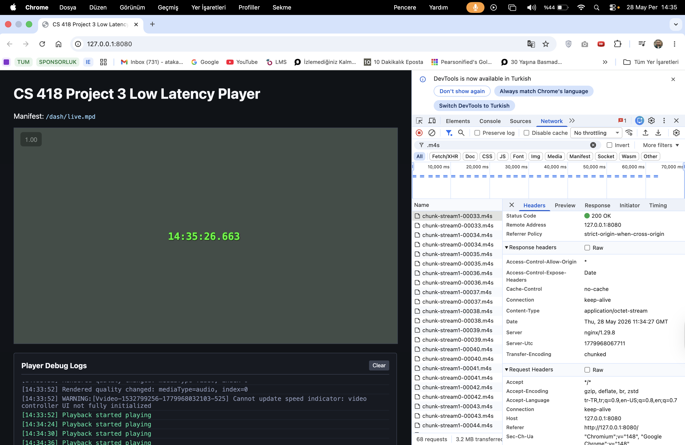
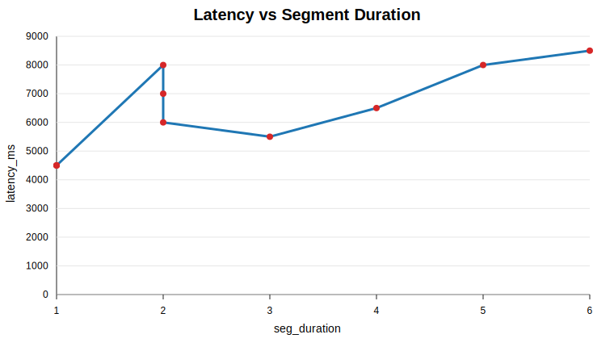
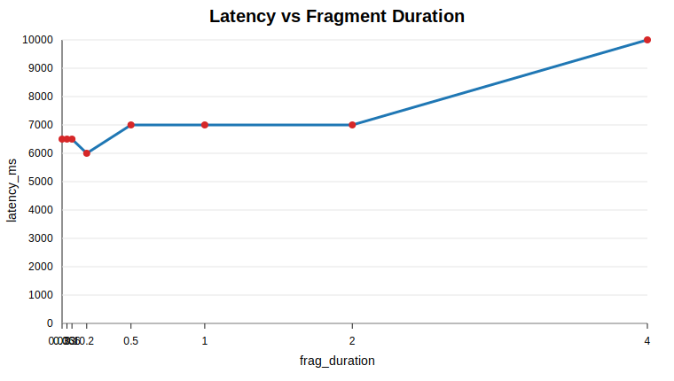

# CS 418 Project 3 Final Report: Low Latency DASH Streaming

**GitHub Repository:** <https://github.com/atakankaratass/cs418-project-3-low-latency>

**Student:** Atakan Karatas

**Course:** CS 418

**Project:** Project 3 - Low Latency

## 1. Introduction

This report presents the design, implementation, and evaluation of a low-latency DASH streaming pipeline. The system combines OBS for live capture, a source-modified FFmpeg build for DASH packaging, NGINX and node-gpac-dash for HTTP chunked delivery, and dash.js for browser playback. The main technical focus was reducing glass-to-glass latency while keeping playback stable enough for live viewing in the browser.

Several encoder and DASH packaging configurations were tested before reaching a stable low-latency profile. After correcting for a 1-second clock offset in the measurement setup, some settings produced smooth playback but stayed around 5-7 seconds, while more aggressive settings reduced delay at the cost of dash.js stalls. The most reliable validation profile used reduced OBS output settings with 1-second DASH segments and reached approximately **4.0 seconds** of adjusted measured latency.

The following sections describe the pipeline architecture, the FFmpeg source modification, the validation evidence, the segment-duration and fragment-duration experiments, and the main implementation difficulties.

## 2. System Architecture

The implemented path is shown below as a live-delivery chain rather than a single command-style line:

| Stage | Component               | Role in the stream                         |
| ----- | ----------------------- | ------------------------------------------ |
| 1     | OBS                     | Captures the live source and clock overlay |
| 2     | RTMP                    | Carries the live feed into FFmpeg          |
| 3     | Modified FFmpeg         | Packages LL-DASH chunks and segments       |
| 4     | NGINX                   | Serves the player and proxies DASH media   |
| 5     | Modified node-gpac-dash | Sends media using chunked transfer         |
| 6     | dash.js browser player  | Plays the live DASH stream                 |

OBS captures the source and burns the current wall-clock time into the video frame. FFmpeg listens for RTMP input from OBS and writes DASH output to local disk. NGINX serves the browser player and proxies `/dash/` requests to node-gpac-dash. The modified node-gpac-dash server sends media segments using HTTP chunked transfer encoding, so the player can receive partial segment data before the whole segment is finished.

The browser player uses dash.js and loads the live DASH manifest from `/dash/live.mpd`. The page keeps the interface simple and only shows the video player plus debug logs that are useful during validation.

## 3. FFmpeg Source Build And Required Source Modification

The project uses a locally compiled FFmpeg build rather than a pre-installed package. This was necessary because the DASH muxer source needed a small change before FFmpeg could write media segments in the form required by the live chunked-delivery server.

The tutorial explains that FFmpeg normally writes partial DASH media segments with a temporary `.tmp` extension and then renames them later. This causes a problem for node-gpac-dash because node-gpac-dash tries to read the live segment while FFmpeg is still writing it. To fix that, I changed the media segment temp path so FFmpeg writes directly to the final `.m4s` file name.

The source change is small, but it is central to the low-latency path:

| Build state          | DASH muxer temp-path behavior                                                                  |
| -------------------- | ---------------------------------------------------------------------------------------------- |
| Original FFmpeg      | `snprintf(os->temp_path, sizeof(os->temp_path), use_rename ? "%s.tmp" : "%s", os->full_path);` |
| Modified local build | `snprintf(os->temp_path, sizeof(os->temp_path), use_rename ? "%s" : "%s", os->full_path);`     |

This removes the temporary `.tmp` extension so node-gpac-dash can read the live `.m4s` file while FFmpeg is still appending media data. The change matches the tutorial and Appendix A requirement.

The compiled binary was verified with the required build capabilities:

| Verification item | Confirmed value                                                                                                             |
| ----------------- | --------------------------------------------------------------------------------------------------------------------------- |
| DASH demuxer      | `--enable-demuxer=dash`                                                                                                     |
| XML support       | `--enable-libxml2`                                                                                                          |
| DASH muxer flags  | `-ldash`, `-streaming`, `-frag_duration`, `-frag_type`, `-use_template`, `-use_timeline`, `-utc_timing_url`, `-window_size` |

The DASH muxer was also checked for the low-latency options used later in the pipeline, including `-ldash`, `-streaming`, `-frag_duration`, `-frag_type`, `-use_template`, `-use_timeline`, `-utc_timing_url`, and `-window_size`.


## 4. Implementation Details

The FFmpeg command was built around the low-latency DASH options needed by the pipeline. The most important options were organized as follows:

| Area             | Option or setting                                  | Purpose                                                |
| ---------------- | -------------------------------------------------- | ------------------------------------------------------ |
| OBS ingest       | `-f flv -listen 1 -i rtmp://127.0.0.1/live/stream` | Receives the RTMP stream from OBS                      |
| DASH mode        | `-ldash 1`                                         | Enables low-latency DASH behavior                      |
| Chunk writing    | `-streaming 1`                                     | Writes fragmented output progressively                 |
| Manifest style   | `-use_template 1 -use_timeline 0`                  | Matches the tutorial's SegmentTemplate setup           |
| Clock sync       | `-utc_timing_url 'https://time.akamai.com/?iso'`   | Lets dash.js synchronize live timing                   |
| Segment baseline | `-frag_type every_frame`                           | Used for the segment-duration validation profile       |
| Fragment tests   | `-frag_duration <value> -frag_type duration`       | Used when testing different fragment durations         |
| Live window      | `-window_size 2 -extra_window_size 2`              | Keeps the playback window short in final measured runs |

For OBS, I first tried higher quality settings, but they introduced too much delay. Reducing the output resolution and bitrate produced a more practical live profile:

| Profile setting   | Final value |
| ----------------- | ----------- |
| Output resolution | `852x480`   |
| Scaling           | bicubic     |
| Bitrate           | `1200 kbps` |
| FPS               | `30`        |
| Keyframe interval | `1 second`  |
| FFmpeg keyint     | `30`        |
| Segment duration  | `1 second`  |

This was the setup that produced about 4.0 seconds of adjusted latency without visible foreground playback stalls.

## 5. NGINX And node-gpac-dash

NGINX serves the player page and proxies DASH media requests to node-gpac-dash. Proxy buffering is disabled for the DASH path, because buffering would delay media chunks and work against the low-latency goal.

The local node-gpac-dash checkout was also modified. The original behavior did not work correctly with `chunkCount=0`, because it could end the response before media data was sent. I changed the local checkout so `chunkCount=0` means disabled. I also added a short EOF timeout so video and audio responses can finish independently after FFmpeg stops appending to the current `.m4s` file.

This part was one of the harder parts of the project. At first the stream looked like it had no media data. The root cause was not the browser player. It was node-gpac-dash ending the response too early when `chunkCount` was 0. After fixing this behavior, the media started flowing correctly. Later I also saw that audio and video chunk counts did not always match, so a single global `chunks-per-segment` value was not reliable. A short EOF timeout was more stable for the local live setup.

## 6. Browser Chunked Transfer Validation

The browser-side validation focused on whether media was delivered progressively rather than only after a full segment was completed. I verified this in the browser inspector Network tab. The captured request details showed `Transfer-Encoding: chunked` for media segment responses.



This was important because normal DASH playback can work with full segment downloads, but that would not prove the low-latency path. The chunked transfer evidence shows that node-gpac-dash was actually serving the media progressively.

## 7. Live Latency Validation

Latency was measured by comparing the current clock time with the wall-clock time embedded in the video frame by OBS. I also used an internet clock page during manual measurements, but the important value is the difference between the current time and the visible video timestamp.

The successful below-5-second validation result was:

| Setting           | Value             |
| ----------------- | ----------------- |
| OBS output        | 852x480           |
| OBS bitrate       | 1200 kbps         |
| FPS               | 30                |
| Keyframe interval | 1 second          |
| FFmpeg keyint     | 30                |
| Segment duration  | 1 second          |
| Measured latency  | about 4000 ms     |
| Playback          | no visible stalls |

I also noticed that changing tabs or moving away from the player could cause playback waiting events. When the player tab stayed foreground, the low-resolution 1-second segment run stayed stable for 1-2 minutes. When I switched tabs, Chrome/dash.js sometimes stalled and then used live catchup to return near the live edge. For this reason, the final measurements were done with the player foreground.

## 8. Segment Duration Experiment

For this experiment, segment duration was varied while keeping the stream at 30 fps. The keyframe interval was matched to the segment length.

| Segment duration (s) | Keyint | Latency (ms) | Playback observation |
| -------------------- | ------ | ------------ | -------------------- |
| 1                    | 30     | 4000         | Stable and below 5 s |
| 2                    | 60     | 5500         | Stable but above 5 s |
| 3                    | 90     | 5500         | Stable but above 5 s |
| 4                    | 120    | 5500         | Stable but above 5 s |
| 5                    | 150    | 7000         | Above 5 s            |
| 6                    | 180    | 7500         | Stable but above 5 s |

The results show that smaller segment duration helped latency. The `seg_duration=1` run was the strongest result, while `seg_duration=2`, `seg_duration=3`, and `seg_duration=4` clustered just above the 5-second boundary after the clock-offset correction. As segment duration increased further, latency generally increased. This makes sense because the player and DASH live window have more segment-level delay to work with. Larger segments were usually stable, but they did not meet the low-latency target.



## 9. Fragment Duration Experiment

For the fragment experiment, the segment duration was fixed at 4 seconds with `keyint=120`. The OBS output stayed at 852x480 and 1200 kbps, while `frag_duration` was changed using `-frag_type duration`.

| Fragment duration (s) | Latency (ms) | Playback observation       |
| --------------------- | ------------ | -------------------------- |
| 0.033                 | 5000         | Stable, near 5 s           |
| 0.066                 | 5500         | Stable but above 5 s       |
| 0.1                   | 5500         | Stable but above 5 s       |
| 0.2                   | 5500         | Stable but above 5 s       |
| 0.5                   | 6000         | Stable but above 5 s       |
| 1                     | 6000         | Repeated playback waiting  |
| 2                     | 6000         | Waiting and gap correction |
| 4                     | 9000         | Audio buffer instability   |

The fragment-duration experiment did not produce a better result than the 1-second segment validation profile. With fixed 4-second segments, the adjusted measured latency stayed around 5-6 seconds for the smaller fragment values. Larger fragment values caused more visible playback waiting and audio buffer problems. In particular, `frag_duration=1`, `2`, and `4` showed repeated dash.js `PLAYBACK_WAITING` and `GapController` jumps.

This was another difficult part of the project. At first I expected smaller fragments to always reduce the latency a lot. In practice, the full setup also depended on OBS ingest delay, DASH live delay, segment duration, audio/video alignment, and browser behavior. The fragment size alone did not solve the latency problem when `seg_duration` stayed at 4 seconds.



## 10. Testing And Automation

Automated checks were used to keep the implementation and documentation consistent. I used TypeScript scripts to generate experiment matrices, FFmpeg command checklists, latency reports, live validation status, and QR overlay files.

The automated validation command is:

```bash
make validate-pr
```

This command runs linting, type checking, tests, build checks, environment validation, experiment matrix generation, and latency report generation.

GitHub Actions is also configured for project checks. The project uses ESLint, TypeScript typecheck, Vitest tests, Prettier, Husky, and lint-staged. This helped catch mistakes in generated files and scripts. For example, one latency CSV issue was fixed by adding parser support for explicit `latency_ms` values when the observed timestamps are not ISO timestamps.

I also used OpenCode and Antigravity during development to automate repetitive checks, run tests, and generate supporting files. These tools were used as development assistance, not as a replacement for live validation. The actual screenshots, latency measurements, and browser inspector evidence came from real local runs.

## 11. QR Code Bonus

I also implemented an optional QR timestamp overlay. It generates a QR payload in this format:

```text
cs418-project3-ts=<ISO timestamp>
```

This can be added to OBS as a Browser Source. The helper code and tests for QR timestamp formatting and latency subtraction are included. However, I did not complete a real QR decode measurement from the received video frame. Because of that, I am not using QR latency as the required validation result. The required validation result in this report is still the wall-clock overlay measurement.

## 12. Main Difficulties

The biggest difficulty was that every part of the pipeline could add latency or cause stalls. At the beginning, the stream did not send media correctly because node-gpac-dash ended segment responses too early when `chunkCount=0`. After that was fixed, another issue appeared around segment boundaries. dash.js showed `PLAYBACK_WAITING`, and the logs showed `GapController` jumping around `0.1s`. This happened more with some 4-second segment and fragment configurations.

Another difficulty was measuring latency consistently. I recorded the higher latency values too, including runs that were stable but above 5 seconds and runs that had stalls. After identifying a 1-second clock offset in the measurement setup, I adjusted the recorded latency values by subtracting 1000 ms. This made the final results more accurate while keeping the same relative trend: the 1-second segment low-resolution profile was the strongest configuration in this local environment.

The FFmpeg source modification also had to be checked carefully. It was not enough to use Homebrew FFmpeg or a random system FFmpeg. I verified the source-built binary, the configure flags, and the actual `dashenc.c` patch.

## 13. Conclusion

The final implementation uses OBS, RTMP, modified source-built FFmpeg, LL-DASH packaging, NGINX, modified node-gpac-dash, and dash.js. I verified browser chunked transfer encoding and measured latency using the wall-clock timestamp in the video.

The final passing profile was the low-resolution `seg_duration=1`, `keyint=30` run, with about **4.0 seconds** adjusted latency and no visible foreground playback stalls. The segment-duration experiment showed that larger segment durations generally increased latency. The fragment-duration experiment showed that changing fragment duration alone did not beat the 1-second segment profile, and larger fragment durations caused repeated playback waiting.

Overall, the project reached the required below-5-second latency, but it also showed that low-latency streaming is sensitive to encoder settings, segment duration, player live delay, server behavior, and browser playback state.

## References

CS 418. (2026). _Project 3: Low Latency_ [Course assignment handout]. `Low Latency.docx`.

Zhang, B. (n.d.). _Low-latency DASH streaming using open-source tools_. Medium. Retrieved May 29, 2026, from <https://bozhang-26963.medium.com/low-latency-dash-streaming-using-open-source-tools-f93142ece69d>

FFmpeg Developers. (n.d.). _FFmpeg formats documentation_. Retrieved May 29, 2026, from <https://ffmpeg.org/ffmpeg-formats.html>

OBS Project. (n.d.). _OBS Studio_. Retrieved May 29, 2026, from <https://obsproject.com>

FFmpeg Developers. (n.d.). _Compilation guide for Ubuntu_. FFmpeg Wiki. Retrieved May 29, 2026, from <https://trac.ffmpeg.org/wiki/CompilationGuide/Ubuntu>

DASH Industry Forum. (n.d.). _Low Latency DASH change request_ [Technical change request]. Referenced by Zhang (n.d.).
